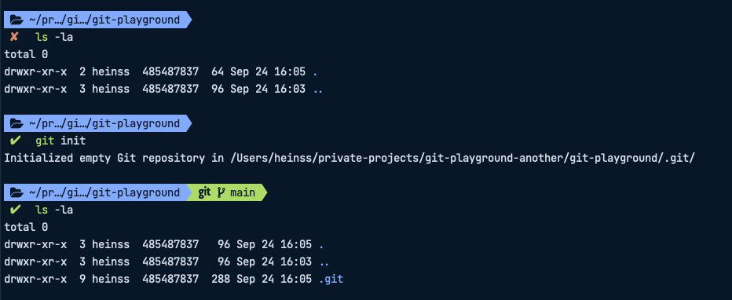
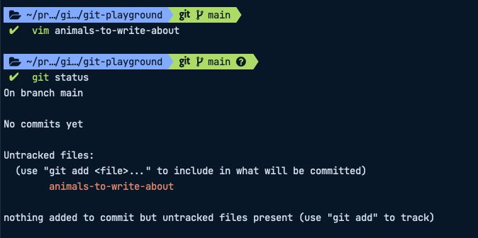
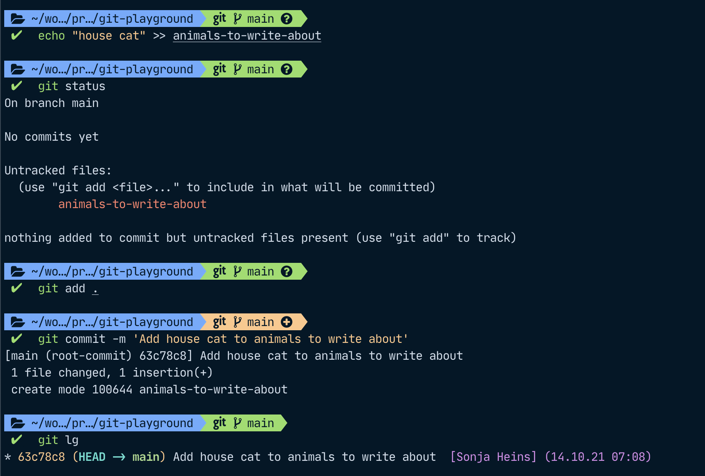

# A practical introduction to git – jumping in with both feet

If you're a developer, you have probably heard about git. If you haven't used it yourself yet, or not a lot, you might also be a bit scared by all the different words – commits, branches, pushing, cherry-picking, rebasing, … what is all that stuff? And why is version control so hard? What if I do the wrong thing and I end up losing everything?

First up, git doesn't lose anything you have committed. It might be a bit harder to find but don't despair. We'll get you there.
But let's start at the beginning without any looming threat of losing your changes.

## Your task

Let's say you're tasked with creating an encyclopedia on animals. This is something that will require a lot of work, and re-working articles, so you want to know your articles are safe and sound. You decide to start a git repository to commit your changes.

## Setup

### Initializing your git repository

In your shell, create a new directory and initialize your git repository but running `git init`:



As you can see, this creates to a hidden folder `.git`. If we delete this folder again, your directory will no longer be a git repository.

### Configure

In order not to get mixed up with different authors, you will want to set your name and email in your git config.
You can either do so globally for the current logged-in user by running it with the `--global` modifier which sets it for all repositories, or for just this one repository if you run these commands with the `--local` flag or leaving out the flag altogether since "local" is the default setting.

```shell
git config --global user.name "Evelyn Example"
git config --global user.email evelyn@example.com
```

## Getting started on content

Now that we've got this out of the way, let's get started!
You might have noticed that git has automatically created a branch named "main" for us (or, depending on your settings, this may also be called "master". If you want to change the name of the default branch that gets created on running git init, you can run `git config --global init.defaultBranch main` , or whichever name you prefer instead of `main`).

Depending on which approach you are using when developing, you may work with additional branches, then creating merge requests that need to be approved so you can move these changes onto the main branch, or just the main branch.
Let's assume we're the only collaborator on this encyclopedia for now and thus, we can use the main branch to make our changes and will not run into trouble.

### Adding files

At first, we might want to create a list of animals we want to write articles on. We create a file `animals-to-write-about` and add a line `house cat` because, hey, everyone seems to be crazy about cats, so our encyclopedia needs to have an article on them.



If we want to know what the current status of our repository is, we can run `git status`.\
Git says our file is an *untracked file*… but what does that mean?

If git does not yet know about a file, it is **untracked**. If we want to add it to git, we can run `git add <file>` or just add all files with `git add .` (the dot at the end means all files in the current directory and sub-directories). In the next step, we can then `git commit` these files. Only files that have been committed are safe from being lost, so we want to make sure we always commit any changes that we want to keep.
By adding the `-m` flag and then a note in quotation marks or single quotes, we can add a commit message. This should always start with an upper case verb in the present tense. For more pointers on how to write good commit messages, have a look at [this article by Chris Beams](https://chris.beams.io/posts/git-commit/).



### Git aliases

What was this `git lg` command I just used to look at the changes? It was a git alias. This is a handy way to save all your typing energy for that encyclopedia.
You can add your own aliases by editing the `~/.gitconfig` file (on Linux / MacOS). My list looks like this:

```shell
# This is Git's per-user configuration file.
[user]
	email = s.heins@example.com
	name = S Heins
[credential]
	helper = osxkeychain
[alias]
	s = status
	c = commit -m
	co = checkout
	lg = !clear && git log --all --graph --pretty='format:%C(auto)%h%d %s  %C(magenta)[%an] (%ad)%C(reset)' --date=format:'%d.%m.%y %H:%M'
	p = pull --all -p
[core]
	excludesfile = /Users/heinss/.gitignore_global
[commit]
	template = /Users/heinss/.gitmessage.txt
[pull]
	rebase = true
[init]
	defaultBranch = main
```

I highly recommend adding the alias under `lg` for a pretty git tree right in your command line.
