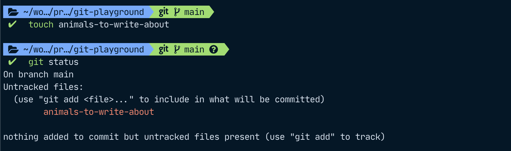

# A practical introduction to git – jumping in with both feet


If you're a developer, you have probably heard about the version control system, git. If you haven't used it yourself yet, or not a lot, you might also be a bit scared by all the different words – commits, branches, pushing, cherry-picking, rebasing, … what is all that stuff? And why is version control so hard? What if I do the wrong thing and I end up losing everything?

First up, git doesn't lose anything you have committed. It might be a bit harder to find but don't despair. We'll get you there.
But let's start at the beginning without any looming threat of losing your changes.

This will be the first article in a series and it will tell you how to set up your repository from the command line, how to add changes and save ("commit") them, how to set your name and email address to be added as metadata to those changes, and how to do define a git alias, namely one to get a pretty git tree of your changes in the console.

(Cover image by [Nerry Burg](https://freeimages.com/photographer/nexxy-42715) from [FreeImages](https://freeimages.com))

## Why version control?

If you add some files or change their contents, you'll want to have a way to save your progress. The difference between having the file in a version control system such as git rather than just saving it on your hard drive is that you have a history of the file along with additional metadata – you could revert back to an old version if you wanted to, look at exactly which changes were introduced when, by whom, and, if they wrote a meaningful message, why they did those changes.

## Your task

Let's say you're tasked with creating an encyclopedia on animals. This is something that will require a lot of work, and re-working articles, so you want to know your articles are safe and sound. You might also want to revert some changes if your editor tells you to get rid of that article on flamingos one day and then changes their mind the next. You decide to start a git repository to commit your changes.

## Setup

### Initializing your git repository

In your shell, create a new directory and initialize your git repository by running `git init`:


As you can see, this creates to a hidden folder `.git`. If we delete this folder again, your directory will no longer be a git repository.

### Configure

So that other people know whom to contact regarding the changes you introduced because they might have some questions (or if you want to be able to run into some code and then marvel at the fact that these changes here were done by yourself a year ago and now you can't remember very much about them), you will want to set your name and email in your git config.
You can either do so globally for the current logged-in user by running it with the `--global` modifier which sets it for all repositories you commit to from this user on your machine, or for just this one repository if you run these commands with the `--local` flag or leaving out the flag altogether since "local" is the default setting.

```shell
git config --global user.name "Evelyn Example"
git config --global user.email evelyn@example.com
```

## Getting started on content

Now that we've got this out of the way, let's get started!
You might have noticed that git has automatically created a branch named "main" for us (or, depending on your settings, this may also be called "master". If you want to change the name of the default branch that gets created on running git init to something other than `master`, you can run `git config --global init.defaultBranch main` , or whichever name you prefer instead of `main`).

Depending on which approach you are using when developing, you may work with additional branches, then creating merge requests that need to be approved so you can move these changes onto the main branch, or alternatively, just work with the main branch.
Let's assume we're the only collaborator on this encyclopedia for now and thus, we can use the main branch to make our changes and will not run into trouble. (If multiple people are working on just one branch, it requires a team that is highly coordinated so those changes keep getting reviewed)

### Adding files

At first, we might want to create a list of animals we want to write articles on. We create a file `animals-to-write-about` and add a line `house cat` because, hey, everyone seems to be crazy about cats, so our encyclopedia needs to have an article on them.



If we want to know what the current status of our repository is, we can run `git status`.\
Git says our file is an *untracked file*… but what does that mean?

If git does not yet know about a file, it is **untracked**. If we want to add it to git, we can run `git add <file>` or just add all files with `git add .` (the dot at the end means all files in the current directory and sub-directories). In the next step, we can then `git commit` these files. Only files that have been committed are safe from being lost, so we want to make sure we always commit any changes that we want to keep.
By adding the `-m` flag and then a note in quotation marks or single quotes, we can add a commit message. This should always start with an upper case verb in the present tense. For more pointers on how to write good commit messages, have a look at [this article by Chris Beams](https://chris.beams.io/posts/git-commit/).


### Git aliases

What was this `git lg` command I just used to look at the changes? It was a git alias. This is a handy way to save all your typing energy for that encyclopedia.
You can add your own aliases by editing the `~/.gitconfig` file (on Linux / MacOS). My list looks like this:

```shell
# This is Git's per-user configuration file.
[user]
	email = s.heins@example.com
	name = S Heins
[credential]
	helper = osxkeychain
[alias]
	s = status
	c = commit -m
	co = checkout
	lg = !clear && git log --all --graph --pretty='format:%C(auto)%h%d %s  %C(magenta)[%an] (%ad)%C(reset)' --date=format:'%d.%m.%y %H:%M'
	p = pull --all -p
[core]
	excludesfile = /Users/heinss/.gitignore_global
[commit]
	template = /Users/heinss/.gitmessage.txt
[pull]
	rebase = true
[init]
	defaultBranch = main
```

I highly recommend adding the alias under `lg` for a pretty git tree right in your command line.

## Outlook: Working with remotes and branches

In the next article, we will be looking at how to work with remotes in case you want to save your work somewhere other than just your local machine and how to work with branches.

If you work with multiple collaborators, working with branches in conjunction with a version control service such as github or gitlab that lets you create requests to propagate these changes into the main branch enables you to first review the changes before they go into your main branch most easily. Propagating changes from one branch to the other is called *merging* one branch into the other.
Otherwise, collaborators would commit in the main branch and if something goes seriously wrong, they would have to roll back those changes. Or if a commit needs to be reworked, additional rework commits need to be added, potentially bloating up your tree instead of the collaborator being able to still add them to their commit before merging. There are working modes though that use only one branch; this is called trunk-based development.
However, most teams I have worked in have chosen to work with branching and so-called *merge requests*, also called *pull requests*.
More on working with branches in the next post though!

## Conclusion and command summary

We created our first local git repository, and added and committed a file to it!

Here are some commands to keep in mind:

* `git init` to initialize a local git repository
* `git status` to show the current status of a repository and the files it contains
* `git add .` to add all files
* `git commit -m 'My message'` to commit those changes with a commit message (i.e. propagate those changes to the branch and thus keep them from being lost)
* setting some options in the global git config file at `~/.gitconfig`:
  * `git config --global user.name "Evelyn Example"` to set the author name globally (for all git repositories)
  * `git config --global user.email evelyn@example.com` to set the author email address globally
  * `git config --global init.defaultBranch main` to set the default branch name when initializing a new repository to `main` globally
