# Branching and working with remotes


In the Introduction article, we looked at how to set up a local git repository, how to configure git and create aliases, and how to add and commit files on the example of creating an encyclopedia with articles and a list of topics to write about. We have also added some aliases to our gitconfig file at `~/.gitconfig`, such as this one that lets us print a neat-looking tree in the command line to show us the git history. I'm adding it here again since we will keep using it throughout this article.

```shell
[alias]
lg = !clear && git log --all --graph --pretty='format:%C(auto)%h%d %s  %C(magenta)[%an] (%ad)%C(reset)' --date=format:'%d.%m.%y %H:%M'
```

Now we will look at how to save your work remotely so that you won't only have access to it locally on your machine but also on other machines and you can work with collaborators. Your encyclopedia is going places and at any rate, you wouldn't want to do it all by yourself. It's time to give this thing called balance a go and let other people join in on your project.

(Cover image by [fabrizio turco](https://freeimages.com/photographer/zirak-34282) from [FreeImages](https://freeimages.com))

## Working with remotes

All you have for now is your changes on your own machine. Anything that you commit will not be lost as long as your machine is working, but you can't share it with anyone else easily nor will it be safe if your device decides to stop working.

Firstly, you need to settle on a place to host your repository. This could be github or gitlab, for example.
After creating an account, you can create your repository.
On how to set up a repository, please see these articles in their respective documentation: [Github](https://docs.github.com/en/get-started/quickstart/create-a-repo), [Gitlab](https://docs.gitlab.com/ee/user/project/repository/)

After I created a new repository on github, it already showed me some instructions on how to push an existing git repository:

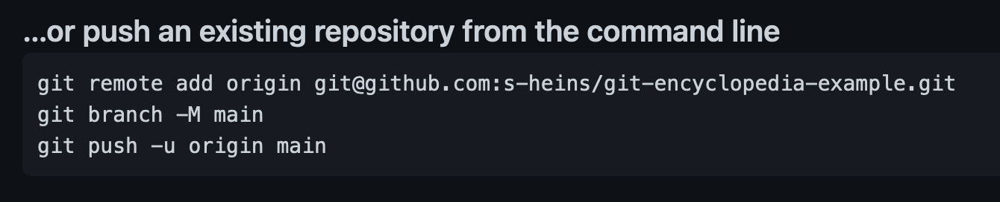

The first line is adding a so-called `origin` to our local repository. This is referencing our new repo on github. In this example you can see that I have chosen to use SSH but this can be switched with a button further on top if you want to use HTTP. Using SSH will require you to set up a private and public SSH key pair whereas you will only have to authenticate with your username and password or access key if you use HTTP, so it will be easier if you have never done this before.
Since I had previously connected to github on my machine, I was not prompted for my login credentials here. If you are, enter the credentials you are prompted for and then you are able to push to your remote repository.

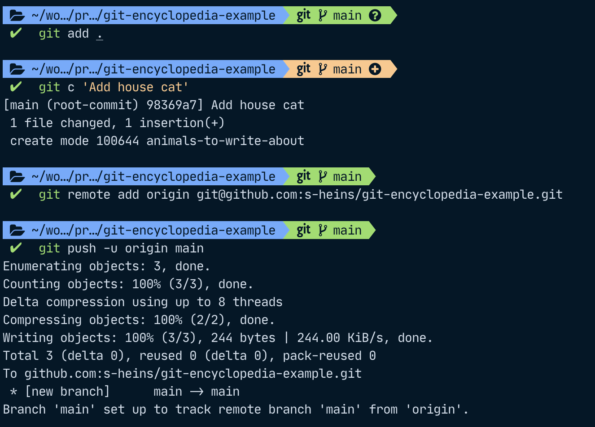

After pushing, you can now see your changes on the site you have chosen as a host after refreshing in the browser. It will also show the last commit message, "Add a house cat" in this example, and your files.

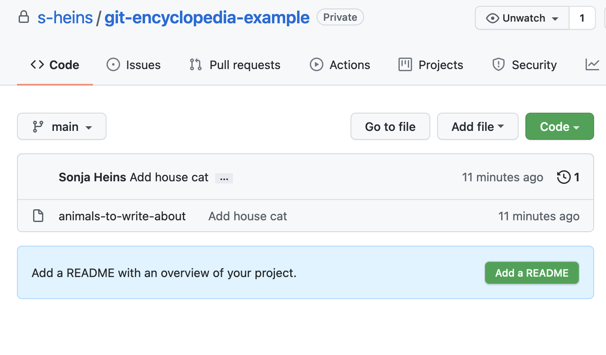

## Cloning a remote

For now, we have worked alone on our encyclopedia, or rather, the list of animals we want to write about.
Our git history will look something like this; it's a single line since we have only worked on one branch.

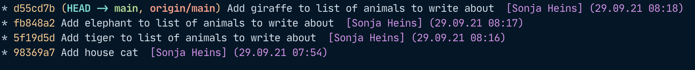

However, our editor tells us to get cracking since so far, we have only made one measly list of animals to write about, it's not quite an encyclopedia. We have already pushed our repo, so we're ready to have collaborators join us in this project!
We have managed to recruit Anna Animallover and Wolfgang Wanderlust to join us. Anna is going to help us complete our list of animals and then write articles on them and Wolfgang will write about cities of interest.

First, Anna and Wolfgang will have to clone our repository by running `git clone <repository-address>`.

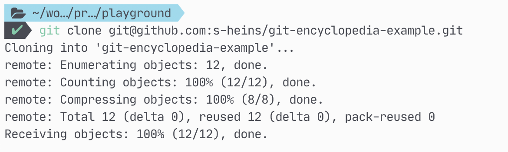

You can find the address for your repository on the site you have chosen to host it. On github, it looks like this. As before, you can choose either HTTP or SSH which will change the link. In this example, it is `https://github.com/s-heins/git-encyclopedia-example.git` for HTTP and `git@github.com:s-heins/git-encyclopedia-example.git` for SSH.

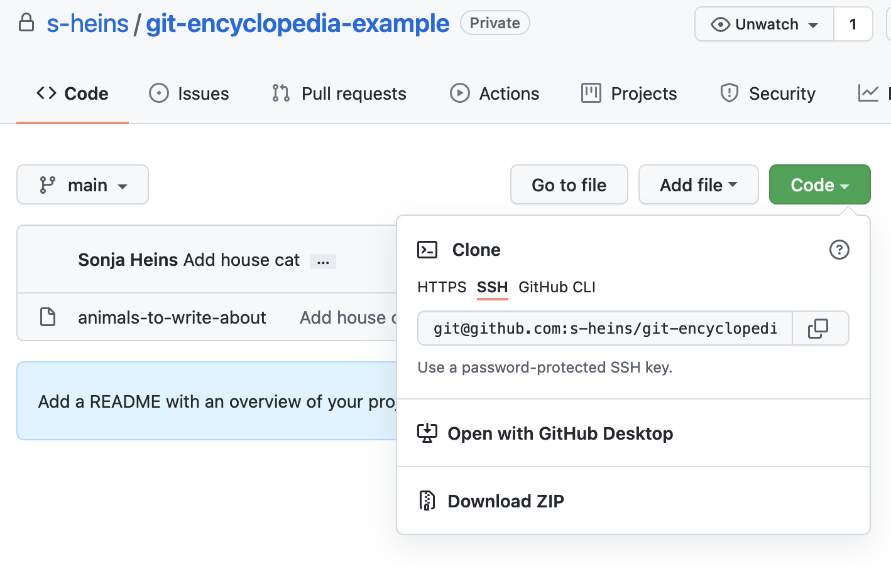

## Branching

The first thing Anna wants to do is create a new branch. This way we can keep the main branch for things that have already been reviewed and we can have our in-progress work in the other branches of our project.

### Creating a new branch

To create a new branch and switch to it, use `git checkout -b "my-branch-name"`. In case you are working with tickets on Jira for example, it makes it easy to get a good overview on what tickets are currently being worked on if you prefix your branch with the ticket name, for example "ENC-001_add-animal-articles" if your ticket number is "ENC-001".

### Pushing a new branch to origin

After Anna has added some articles (`git add .`) and committed them to her local repository (`git commit -m "My message"`), she wants to push those changes to the remote.
She can do so by running `git push -u origin my-branch-name`.

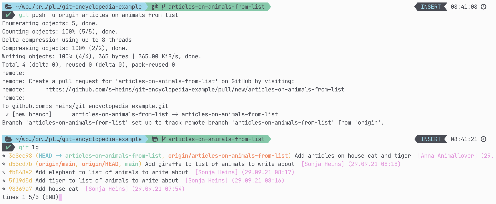

From my machine, I can now `git pull` and git will tell me that a new branch has been created. We can check it out by running `git checkout articles-on-animals-from-list`. This will switch my working branch to Anna's branch and since we just pulled, we will also have her latest changes.


After we have created articles for the animals that are still missing from the list, we can add those changes to a commit and push them. This time, git already knows the upstream branch (namely, `origin/articles-on-animals-from-list`), and thus we can just use `git push` without arguments.

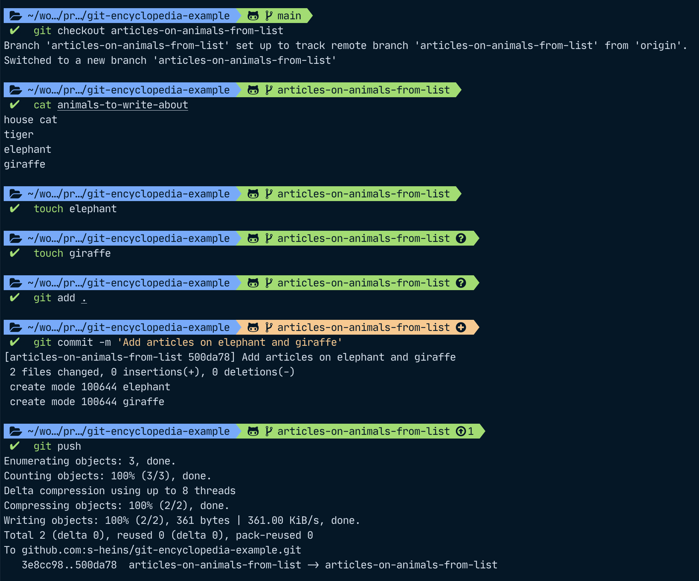

After Anna pulls again, she will also have my changes.

By using the same branch and adding our commits, we can safely collaborate. Anna and me can both commit and push our changes as we go along. We just shouldn't both alter the same file at the same time or we will get conflicts that we will need to resolve.

## Resolving conflicts

Let's say Anna and I both have the idea to add more animals to our list. I add a gorilla and a chimpanzee, she adds an alligator and a crocodile. I push first so now the file will have updated without Anna knowing about it.

When Anna tries to push her commit, git will not let her. It rejects to commit and tells her to pull first.

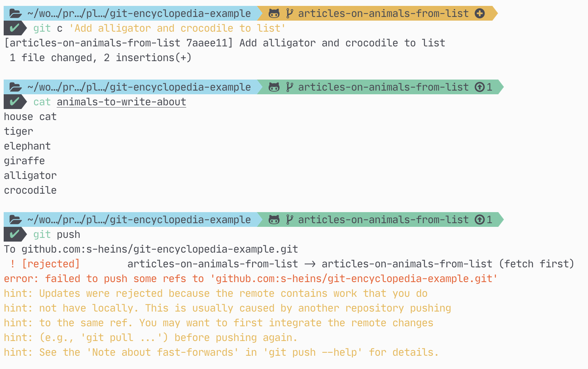

Once Anna pulls, git now tells her she has a conflict. If you use an IDE with version control functionality, you can also resolve them there, but we will go the manual way here.
As you can see, the contents of the file have a line saying `HEAD` that contain my changes, the changes that I have already pushed to our branch on the remote, another line of equals signs as separators, then her changes where she added the alligator and the crocodile, and then a line with the name of her commit, `7aaee11`, and her commit message (`Add alligator and crocodile to the list`).

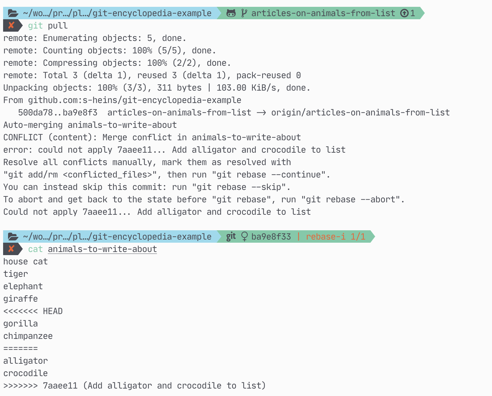

If we look at the git tree in the console again, we can see that Anna's commit, `7aaee11` and my commit that is pushed to the upstream, `ba9e8f3` both have the same parent. We now have to resolve the conflicts so that Anna's commit can be put on top of mine.

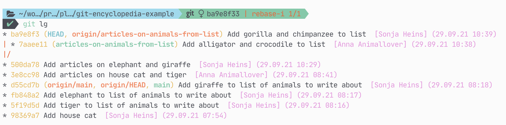

We can now edit the file to remove the three lines git has added to show us the parts of the file where we have conflicts. Since we want to retain all animals, we only need to delete these lines. As you can see on the screenshot, the file only has the list of animals afterwards, and the lines with the `<<<<`, `>>>>` and `====` are no longer contained.

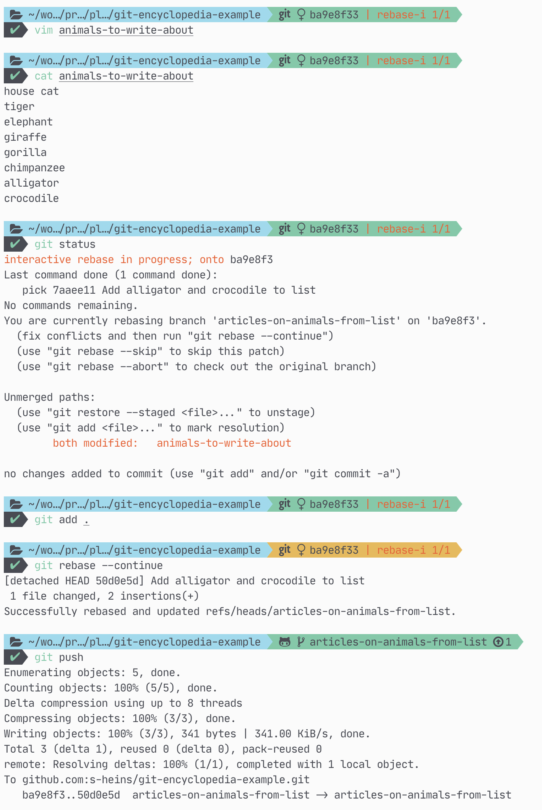

After we have resolved the conflicts, we need to add the file so git knows that we can continue reconciling the changes that Anna and I have made.
In this case, I have put a line in my `~/.gitconfig` file telling git it should *rebase* rather than try to *merge* any conflicts. That means that it will try to make it as if Anna's changes had come after my own. We will go into the difference between merging and rebasing in a later article. For now, it doesn't matter that much which one you pick. If you look at the above screenshot, you will see git tells me to run `git rebase --continue` once I am done resolving my conflicts. If you chose `merge` as a pull strategy, it will tell you to run `git merge --continue` instead. This will only have an impact on how your tree looks afterwards but it will not have any impact on your file changes.

If we now look at the git tree after finishing the rebase, we can see that it looks as if Anna had done her changes after mine.

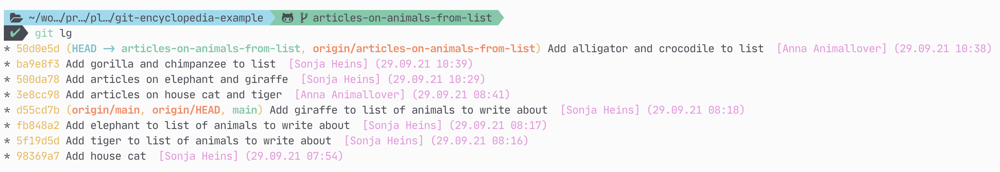

## Conclusion and command summary

We have looked at how to push our changes to a remote repository and have created our first branch, kept adding and committing and have resolved our first conflict!

Here are some commands to keep in mind:

* `git clone <address>` to clone a remote repository
* `git checkout -b 'my-branch-name'` to create a new branch and switch to it
* `git push -u origin my-branch-name` to push a branch to a remote
* `git checkout my-branch-name` to switch to an existing branch from the remote
* `git pull` to pull changes from the remote
* `git rebase --continue` or `git merge --continue` to continue a rebase or merge after adding files