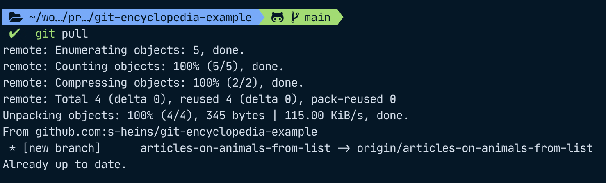

# Branching and working with remotes

In the Introduction article, we looked at how to set up a local git repository, how to configure git and create aliases, and how to add and commit files on the example of creating an encyclopedia with articles and a list of topics to write about.

Now we will look at how to save your work remotely so that you won't only have access to it locally on your machine but also on other machines and you can work with collaborators. Your encyclopedia is going places and at any rate, you wouldn't want to do it all by yourself. It's time to give this thing called balance a go and let other people join in on your project.

## Working with remotes

All you have for now is your changes on your own machine. Anything that you commit will not be lost as long as your machine is working, but you can't share it with anyone else easily nor will it be safe if your device decides to stop working.

Firstly, you need to settle on a place to host your repository. This could be github or gitlab, for example.
After creating an account, you can create your repository.
On how to set up a repository, please see these articles in their respective documentation: [Github](https://docs.github.com/en/get-started/quickstart/create-a-repo), [Gitlab](https://docs.gitlab.com/ee/user/project/repository/)

After I created a new repository on github, it already showed me some instructions on how to push an existing git repository:

The first line is adding a so-called `origin` to our local repository. This is referencing our new repo on github. In this example you can see that I have chosen to use SSH but this can be switched with a button further on top if you want to use HTTP. Using SSH will require you to set up a private and public SSH key pair whereas you will only have to authenticate with your username and password or access key if you use HTTP, so it will be easier if you have never done this before.
Since I had previously connected to github on my machine, I was not prompted for my login credentials here. If you are, enter the credentials you are prompted for and then you are able to push to your remote repository.

After pushing, you can now see your changes on the site you have chosen as a host after refreshing in the browser. It will also show the last commit message, "Add a house cat" in this example, and your files.

## Cloning a remote

For now, we have worked alone on our encyclopedia, or rather, the list of animals we want to write about.
Our git history will look something like this; it's a single line since we have only worked on one branch.

However, our editor tells us to get cracking since so far, we have only made one measly list of animals to write about, it's not quite an encyclopedia. We have already pushed our repo, so we're ready to have collaborators join us in this project!
We have managed to recruit Anna Animallover and Wolfgang Wanderlust to join us. Anna is going to help us complete our list of animals and then write articles on them and Wolfgang will write about cities of interest.

First, Anna and Wolfgang will have to clone our repository by running `git clone <repository-address>`.

You can find the address for your repository on the site you have chosen to host it. On github, it looks like this. As before, you can choose either HTTP or SSH which will change the link. In this example, it is `https://github.com/s-heins/git-encyclopedia-example.git` for HTTP and `git@github.com:s-heins/git-encyclopedia-example.git` for SSH.

## Branching

The first thing Anna wants to do is create a new branch. This way we can keep the main branch for things that have already been reviewed and we can have our in-progress work in the other branches of our project.

### Creating a new branch

To create a new branch and switch to it, use `git checkout -b "my-branch-name"`. In case you are working with tickets on Jira for example, it makes it easy to get a good overview on what tickets are currently being worked on if you prefix your branch with the ticket name, for example "ENC-001_add-animal-articles" if your ticket number is "ENC-001".

### Pushing a new branch to origin

After Anna has added some articles (`git add .`) and committed them to her local repository (`git commit -m "My message"`), she wants to push those changes to the remote.
She can do so by running `git push -u origin my-branch-name`.

From my machine, I can now `git pull` and git will tell me that a new branch has been created. I can check it out by running `git checkout articles-on-animals-from-list`.

