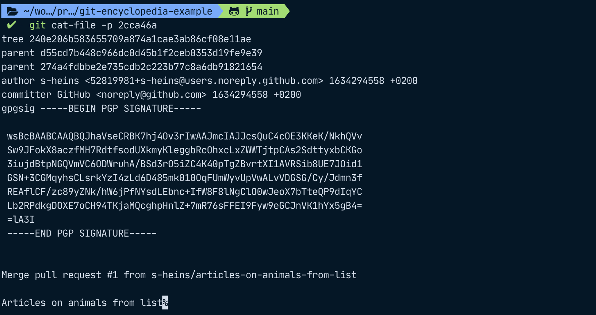

# A deeper look: Git behind the scenes

In the [first article](https://dev.to/sheins/-a-practical-introduction-to-git-jumping-in-with-both-feet-2o56), we have looked at how to initialize a git repo locally, add and commit, and set some configuration options.
Next, the second article covered how to work with remotes and branches, how to resolve conflicts, and how to merge and delete branches both from the CLI or from the GitHub UI.

Now that we have gained some overview over the basic functions of git, it is time for an excursion into some basics on how git works behind the scenes. How does git notice that a file has changed so that it can show us this in our status? How does git realize branches? How does git know the order of the commits in each branch? What is HEAD and what is this mysterious detached HEAD state? And most importantly, how do I get out of this state again?

As a resource for this article, I have used the [Pro Git book, written by Scott Chacon and Ben Straub](https://git-scm.com/book/en/v2) which is available for free and may be shared non-commercially.

Because the details of how git works exactly can easily make up a book (as seen above), we will only look deeply enough in this article to set the stage for more advanced git maneuvers such as rebasing, where you replay your work on top of a different commit than the one you originally set out from, and to give some context to the commands we have covered in the first two articles.

- [A deeper look: Git behind the scenes](#a-deeper-look-git-behind-the-scenes)
  - [How does git know a file has changed?](#how-does-git-know-a-file-has-changed)
  - [File status lifecycle and git project sections](#file-status-lifecycle-and-git-project-sections)
    - [Git project sections](#git-project-sections)
    - [Git file status lifecycle](#git-file-status-lifecycle)
    - [One file can have multiple changes in different states at once](#one-file-can-have-multiple-changes-in-different-states-at-once)
  - [Anatomy of a commit](#anatomy-of-a-commit)
  - [Back to the start – creating a repository](#back-to-the-start--creating-a-repository)
  - [References](#references)
    - [Branches](#branches)
    - [Tags](#tags)
    - [HEAD](#head)
    - [Detached HEAD state](#detached-head-state)
  - [Conclusion and command summary](#conclusion-and-command-summary)

## How does git know a file has changed?

Git does not store the exact differences between files (for example, add the line "house cat" to your file "list-of-animals-to-write-about"), but rather, it stores **snapshots**. For this example, git has a snapshot of the file before adding that line and then compares it to the current version of the file to figure out if something has changed.

To do this, git computes a SHA-1 hash value based on the contents for each file and uses it for checksumming. SHA-1 is a cryptographic hash function that makes it highly unlikely to create the same hash for two different files, so if the hash is the same, we can assume that it was created based on the same input. If the checksum of a file has changed, the file itself must have changed. If a file was deleted and another was added but they share the same checksum, they must have the same contents – this is how git knows that a file was renamed. If the contents of a file have changed, the name will be the same but its hash will be different.

In case a file has not changed at all in a commit, git will not store the file itself again, just a link to the one it has already saved in a previous snapshot.

## File status lifecycle and git project sections

In the first article, we have already added and committed files and file changes. Git has three states for any file it already knows about: **modified**, **staged**, and **committed**. It then also has a fourth state for any files it doesn't know about: **untracked**.

Let's now look at what different states a file is in, from its creation, adding it, and finally committing it. We will use `git status` to check which status our file is in.


### Git project sections

As a file goes through its lifecycle, it will also travel through different sections of our git project:

* **Working directory**: After adding `new-file`, the file is present in our directory and **untracked**, that means that we created a new file git doesn't know about yet. Any existing files we change will be in the **modified** state.
* **Staging area**: After `git add .`, the changes are now marked as **staged** and are in the staging area. This is also called the **index**.
* **Repository**: After we `git commit` our changes, they will be added to our local `.git` repository as **committed**. We can also push them to add them to our remote repository.

### Git file status lifecycle

We can now look at the file states with regards to sections in the project:

* **Untracked** (Working Directory)
  Files that are not in the staging area and not in your last snapshot (= commit), i.e. files that git doesn't yet know about.
* **Modified** (Working Directory)
  Files that have been modified since the last commit.
* **Staged** (Staging Area)
  Untracked or modified files that were added to the Staging area by `git add`ing them.
* **Committed** (Repository)
  Files that were committed to the repository by running `git commit` after they were moved to the staging area.  

Any committed files will move back to the *modified* state after we have changed them, and from there, they can move through the lifecycle again. Any unmodified files will still be in the *committed* state, so safely stored in your git database (so your local `.git` folder and, if you have set up a remote and pushed your commit to it, also in your upstream repository).

If you have any modified files for which you want to skip the staging area, you can run `git commit -a` so that git will commit all tracked files without you having to `add` them first. This does not work for any untracked files, however.

### One file can have multiple changes in different states at once

Git uses the file status to communicate to us what the status of our files is. However, a file can also have multiple states – we could do some preliminary changes, add them to the staging area, and then do some more changes. In that case, git will have multiple snapshots of that file, one snapshot per commit where that file changed, another snapshot for the staged version, and yet another one for the working directory version of our file.\
Git will then show us that the file has some changes that are to be committed and some other changes that are not yet staged:


## Anatomy of a commit

As discussed before, git stores **snapshots**. Specifically, git stores files as `blobs` (binary large objects) within git, as well as the checksums of their file contents and header. Then, it builds a **tree object** (the root project tree) that models the directory structure.

A **commit** then stores some meta information and a **pointer** to that root tree.

Commit metadata includes:

* author of the commit (i.e. the person that wrote or changed the respective lines)
* the committer (the person who committed the work of the author)
* the parent of the commit (if it has one) – this is a pointer to a commit hash

In the example further below, we will see when author and committer can differ: For the merge commit we're going to be looking at, I am the author but GitHub committed for me since I executed the merge on the GitHub UI. Another example would be if someone *rebases* my commits on top of another parent. That means that they will take my work and replay it on top of another parent than the one I used originally. We will focus on such advanced git maneuvers in a subsequent article.

Since every commit contains a reference to its parent (if it has one), we can think of commits as a linked list where each commit has between `0` and `n` parents:

* If a commit has zero parents, it is the very first commit.
* If it has two (or more), it is a merge commit. Usually, two branches would be merged so that the resulting commit would have two parents but it is also possible (albeit unusual) to merge more than two branches.
* If a commit has one parent, it is a "normal" commit, i.e. neither a merge commit nor the very first commit in a repository.

Let's say our collaborators Anna and Wolfgang have been busy and our git tree currently looks like this:


> Hint if you have not read the previous articles:\
> To be able to use the `lg` command alias, add this line to your `~/.gitconfig` file under the [alias] section:
>
>```shell
>[alias]
>lg = !clear && git log --all --graph --pretty='format:%C(auto)%h%d %s  %C(magenta)[%an] (%ad)%C(reset)' --date=format:'%d.%m.%y %H:%M'
>```

In this example, we have merged the branch "articles-on-animals-from-list" into "main" and the commit `2cca46a` (that is also labeled as HEAD on the screenshot) is a merge commit. At the very bottom of the screenshot, `98369a7` ("Add a house cat") is the first commit and has no parent, and all other commits in between have only one parent. The commits `0a6ebca` and `b9eb6d0` have the same parent, but they only have one parent: Our merge commit that we have currently checked out and is the last commit on the main branch.

If you also want to look at the same commit data as me in this article, you can clone my `git-encyclopedia-example` project [on GitHub](https://github.com/s-heins/git-encyclopedia-example) by running `git clone https://github.com/s-heins/git-encyclopedia-example.git` (to clone via HTTPS).

To look at `commit` metadata, we can use `git cat-file -p`, where `-p` lets us pretty-print the object's content.
I'm saying "object" because git stores multiple pieces of information as objects – such as `blob` objects for files, `commit` objects, and `tree` objects which allow us to reference other `tree` objects and `blob` objects to model a file tree. (Any children `tree` objects would then represent folders and `blob` objects would be files). To read more about this, see [chapter 10.2 in the pro git book](https://git-scm.com/book/en/v2/Git-Internals-Git-Objects). The fourth type of git objects are *annotated tags* which we will discuss soon when we talk about *references* in git. For short, we will refer to *annotated tags* as just tags in the following text.

Types of git objects:

* blob
* commit
* tree
* tag

We can use `git cat-file -p` to look at our merge commit, `2cca46a` for example, where we will see that it has two parents and what their commit hashes are. As mentioned before, we can also see that in this case, author and committer are different because I created the merge commit via the GitHub UI.



When git gave us some information about our commit before, it not only included information on the parent commit hashes, the author, and committer, but it also listed an object hash for the root tree that models the directory structure.

From this tree, we can look at the different sub-trees (subdirectories) and files with the command `git ls-tree -rt`, where the `-r` flag will recurse into subdirectories and the `-t` flag will include trees when recursing.

```shell
$ git ls-tree -rt 240e206

100644 blob e69de29bb2d1d6434b8b29ae775ad8c2e48c5391	alligator
100644 blob 4b92c463e35f265b9b43f5beebc9e02df815efb2	animals-to-write-about
100644 blob e69de29bb2d1d6434b8b29ae775ad8c2e48c5391	chimpanzee
100644 blob e69de29bb2d1d6434b8b29ae775ad8c2e48c5391	crocodile
100644 blob e69de29bb2d1d6434b8b29ae775ad8c2e48c5391	elephant
100644 blob e69de29bb2d1d6434b8b29ae775ad8c2e48c5391	giraffe
100644 blob e69de29bb2d1d6434b8b29ae775ad8c2e48c5391	gorilla
100644 blob 3be11c69355948412925fa5e073d76d58ff3afd2	house-cat.md
100644 blob e69de29bb2d1d6434b8b29ae775ad8c2e48c5391	tiger.md
```

In our example, we do not have any directories yet, so git only lists blob objects here.
So let's move all of Wolfgang's articles into a travel directory and look at the tree again.

```shell
$ git commit -m 'Move cities articles into travel subdirectory'

[ENC-002_capital-cities-in-europe cafdadd] Move cities articles into travel subdirectory
 4 files changed, 0 insertions(+), 0 deletions(-)
 rename albania-tirana.md => travel/albania-tirana.md (100%)
 rename austria-vienna.md => travel/austria-vienna.md (100%)
 rename belarus-minsk.md => travel/belarus-minsk.md (100%)
 rename germany-berlin.md => travel/germany-berlin.md (100%)
```

With the commit hash that git tells us in the output, `cafdadd`, we can run `git cat-file -p cafdadd` and find out the hash of the root tree, which we can use for the ls-tree command afterwards. To keep the list a bit shorter, we can tell git to abbreviate the object hashes by using the `--abbrev=<digits>` flag.

```shell
$ git ls-tree -rt --abbrev=7 8ec6421

100644 blob e69de29	alligator
100644 blob 4b92c46	animals-to-write-about
100644 blob e69de29	chimpanzee
100644 blob e69de29	crocodile
100644 blob e69de29	elephant
100644 blob e69de29	giraffe
100644 blob e69de29	gorilla
100644 blob 3be11c6	house-cat.md
100644 blob e69de29	tiger.md
040000 tree ea0789f	travel
100644 blob e69de29	travel/albania-tirana.md
100644 blob e69de29	travel/austria-vienna.md
100644 blob e69de29	travel/belarus-minsk.md
100644 blob 1038ae6	travel/germany-berlin.md
```

Since our journalists were a bit lazy here and have not actually added contents to these files, a lot of files share the same object hash (`e69de29`) – they are all empty.

If we do not use the flag to recurse into subtrees, git will show us that the root tree object only contains information on the animal article blob objects and the travel tree object, and not on the travel article blobs. The information about them will be contained in the travel tree, `ea0789f`, so the hierarchy of these objects looks like this:

```shell
.
├── commit cafdadd 
│   └── tree 8ec6421
│       ├── blob e69de29 alligator
│       ├── blob 4b92c46 animals-to-write-about
│       ├── blob e69de29 chimpanzee
│       ├── # … (other articles on animals)
│       └── tree ea0789f travel
│            ├── blob e69de29 albania-tirana.md
│            ├── blob e69de29 austria-vienna.md 
│            ├── blob e69de29 belarus-minsk.md 
│            └── blob 1038ae6 germany-berlin.md 
```

To find out a bit more on what happens to git objects as we add and commit them, see [this article](https://dev.to/sheins/git-blob-and-tree-objects-during-the-status-lifecycle-1mmd).

## Back to the start – creating a repository

As mentioned in the [first article](https://dev.to/sheins/-a-practical-introduction-to-git-jumping-in-with-both-feet-2o56), git adds a `.git` folder in your working directory when you run the `git init` command.


We can now find all our commits in the `objects` folder within the `.git` folder. Git saves these objects in folders that carry the first two characters of the object hash. The rest of the characters are used as the file name within that folder. For example, our commit `2cca46a` which we looked at with `cat-file` is really called `2cca46ab8626e867e2994cac12eb97887b0a82a2` in full but it is enough to use the short name because there are no other git objects whose name also starts with `2cca46a`. The information for this commit will be contained in a file within the `2c` folder inside the `objects` folder, and this file will be called `ca46ab8626e867e2994cac12eb97887b0a82a2`.


## References

Like in programming, git references point to other things. This could be a commit if we're talking about a branch reference or a tag, or it could be another reference.

### Branches

In case you want to work together with someone, you could always send them the name of your latest commit and they could then check out that commit. That would be a lot of hassle, however, since you would have to keep messaging them any time you make a change to tell them the newest commit hash, and they would need to check their messages constantly. At this rate, no one would want to work with us on any projects and the world would be a sad place.

To make things a lot easier, we can refer to a line of work with branches. Behind the scenes, a branch is just a reference to a commit with the added bonus that if you add a child to this commit, the reference gets advanced to this latest commit. The commit the reference points to then carries information about its parent commits but the branch itself is just a pointer to the latest commit, the so-called **head**. That means that git just infers which commits belong to a branch based on the commit the branch points to and its parent(s) and their parent(s). Git can show us where our branch diverged from main by going backward from the head to its parents and showing us those commits which are not contained in the main branch, i.e. which are not the commit that the main branch points to nor parents of it.

Git saves all information about references in the `refs` folder. Any references for our remotes are contained within `.git/refs/remotes/origin`. As we can also see in our git tree visualization in the command line, `main` points to `75616f3`, the `ENC-003…` reference points to `f82574d`, and the `ENC-002…` reference points to `94a47c8`.


If we look at just the commits in our branch and compare them to the graph view, we can see that our `ENC-002` branch and `main` share a few commits (orange in the screenshot) and they also have some commits that only belong only to them (green in the screenshot). In the tree view above it might seem like `ENC-002` only began with commit `b6eb6d0 (Add article on Tirana in Albania)` but really, it contains all commits that came before.
When we merge this branch to main then, git will create a merge commit that has the latest branch commit and the latest main commit as parents as we can see in our example in the merge commit `2ca46a (Merge pull request #1…)`.


### Tags

Tags are very similar to branches in that they *reference a commit*. However, while *a branch reference auto-advances when you push a new commit* on top of the one that the branch currently points to, *tags stay fixed*.

This is handy if you work with releases for your software and you want to mark a certain commit as a specific version. Then, it would be rather annoying if your tag kept moving as you added more commits; you'd have no way of finding out which commit was associated with your release for version 1.2.4, for example.  

To add a tag to your commit, run `git tag -a "your tag name"`. Afterwards, git will open your default CLI text editor such as nano or vim to let you write a tag message.


After we have added the tag, we can now add more commits on top and we can see that while the branch reference has moved, the tag reference has not.


To learn more about tags and other references, have a look at [chapter 10.3](https://git-scm.com/book/en/v2/Git-Internals-Git-References#tags) of the git pro book.

### HEAD

Before, we mentioned that the latest branch in a commit is also called a head. Git stores information on the currently checked out commit or reference in the `HEAD` file within the `.git` folder. In case we currently have a branch checked out, head will refer to this branch, so `HEAD` will be a reference to our branch reference.
We can also use `HEAD` within git to refer to our branch. So instead of using `git push origin ENC-002_capital-cities-in-europe`, we can also run this following command if we have currently checked out our branch `ENC-002…` and we want to push it to our upstream repo:

```shell
git push -u origin HEAD
```

The `-u` flag is a shorthand for `--set-upstream` which tells git to add our local branch to the upstream repository. Afterwards, we specify our remote repository that git should push to. In most cases this will be called `origin`; in our repo it is also called origin because we told git to call our upstream "origin" when we ran `git remote add origin <repository-address>`.
Finally, `HEAD` is our pointer that points to our branch reference which in turn points to our latest commit (if we have currently checked out a branch).
Git will now create a branch on origin which is called the same as our local branch and points to the same commit.

In the background, git stores information on HEAD in the `.git/HEAD` file. When we run `cat .git/HEAD`, git tells us that our `HEAD` is a reference which points to another reference, namely `ENC-002…`.


### Detached HEAD state

Most of the time, `HEAD` will point to a branch reference which points to the latest commit in a branch but there is also such a thing as **detached HEAD state** where `HEAD` will point to a commit which is not the head of a branch. You move into detached head state by checking out a commit that no branch reference points to and you can move out of it again by either creating a new branch (whose reference will then point to this commit), or by checking out an existing branch.

In the following example, I checked out a previous commit that was not the head of any branch, added and committed a file and created a new branch to move out of detached head state again.


## Conclusion and command summary

In this article, we looked at the different file states (unmodified/committed, untracked, modified, and staged). We saw that each commit contains information on its author, committer and parent commit(s) and how git branches work. That a branch is just a reference to a commit, and that the last commit of a branch is called its head. We also got to know a special reference, `HEAD`, which points to a branch reference (which points to a commit) if we are currently on a branch, or a commit if we are in detached HEAD state.

Here are some commands to remember:

* `git commit -am "my commit message"` to commit all modified files without first staging them (does not work for untracked files)
* `git tag -a "my tag message"` to create an annotated tag, for example if you're working with releases
* `git push -u origin HEAD` as an alternate way of doing `git push -u origin <my-branch-name>`
