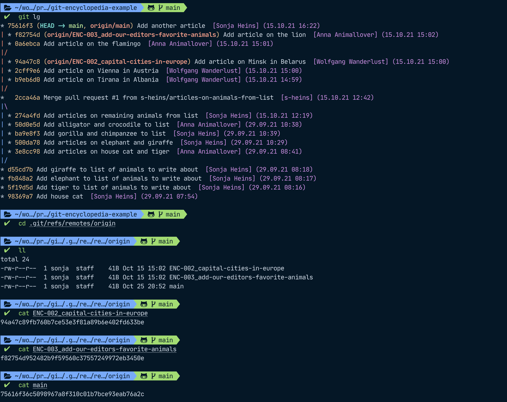
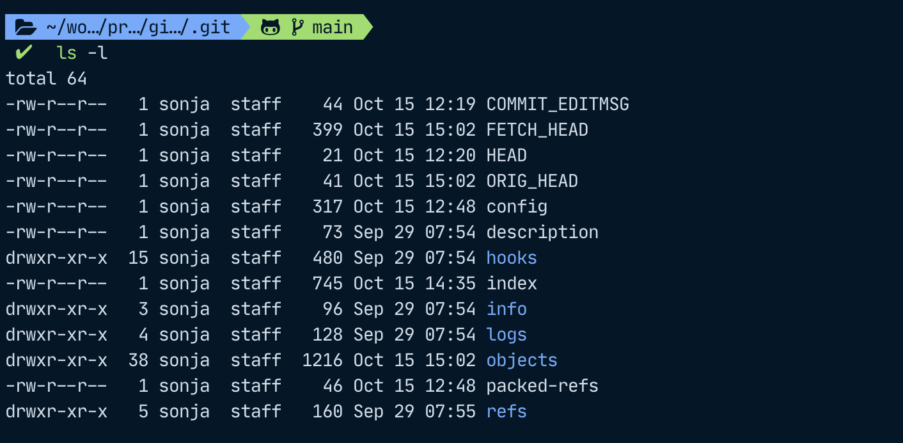

# A deeper look: Git behind the scenes

In the [first article](https://dev.to/sheins/-a-practical-introduction-to-git-jumping-in-with-both-feet-2o56), we have looked at how to initialize a git repo locally, add and commit, and set some configuration options.
Next, the second article covered how to work with remotes and branches, how to resolve conflicts, and how to merge and delete branches both from the CLI or from the GitHub UI.

Now that we have gained some overview over the basic functions of git, it is time for an excursion into how git works behind the scenes. How does git notice that a file has changed so that it can show us this in our status? How does git realize branches? How does git know the order of the commits in each branch?

As a resource for this article, I have used the [Pro Git book, written by Scott Chacon and Ben Straub](https://git-scm.com/book/en/v2) which is available for free and may be shared non-commercially.

## How does git know a file has changed?

Git does not store the exact differences between files (for example, add the line "house cat" to your file "list-of-animals-to-write-about"), but rather, it stores **snapshots**. So it would have a snapshot of the file before adding that line and then compare that to the current version of the file to figure out if something has changed.

To do this, git computes a SHA-1 hash value based on the contents for each file and uses it for checksumming. SHA-1 is a cryptographic hash function that makes it highly unlikely to create the same hash for two different files, so if the hash is the same, we can assume that it was created based on the same input. If the checksum of a file has changed, the file itself must have changed. If a file was deleted and another was added but they share the same checksum, they must have the same contents – this is how git knows that a file was renamed.

If the contents of a file have changed, the name will be the same but its hash will be different.

In case a file has not changed at all in a commit, git will not store the file itself again, just a link to the one it has already saved in a previous snapshot.

## File status lifecycle and git project sections

In the first article, we have already added and committed files and file changes. Git knows three states for any file it already knows about: **modified**, **staged**, and **committed**. It then also has a fourth state for any files it doesn't know about: **untracked**.
Let's now look at what different states a file is in, from its creation, adding it, and finally committing it. We will use `git status` to check which status our file is in.


As a file goes through its lifecycle, it will also traverse different sections of our git project:

* **Working directory**: After adding `new-file`, the file is present in our directory and **untracked**, that means that we created a new file git doesn't know about yet. Any existing files we change will be in the **modified** state.
* **Staging area**: After `git add .`, the changes are now marked as **staged**
* **Repository**: After we `git commit` our changes, they will be added to our `.git` repository as **committed**

We can now look at the file states with regards to sections in the project:

* **Untracked** (Working Directory)
  Files that are not in the staging area and not in your last snapshot (= commit), i.e. files that git doesn't yet know about.
* **Modified** (Working Directory)
  Files that have been modified since the last commit.
* **Staged** (Staging Area)
  Untracked or modified files that were added to the Staging area by `git add`ing them.
* **Committed** (Repository)
  Files that were committed to the repository by running `git commit` after they were moved to the staging area.  

Any committed files will move back to the *modified* state after we have changed them, and from there, they can move through the lifecycle again. Any unmodified files will still be in the *committed* state, so safely stored in your git database (so your local `.git` folder and, if you have set up a remote and pushed your commit to it, also in your upstream repository).

If you have any modified files for which you want to skip the staging area, you can run `git commit -a` so that git will commit all tracked files without you having to `add` them first. This does not work for any untracked files, however.

## Anatomy of a commit

As discussed before, git stores **snapshots**. Specifically, git stores files as `blobs` (binary large objects) within git, as well as the checksums of their file contents and header. Then, it builds a **tree object** (the root project tree) that models the directory structure.

A **commit** then stores some meta information and a **pointer** to that root tree.

Commit metadata includes:

* author of the commit (i.e. the person that wrote or changed the respective lines)
* the committer (the person who committed the work of the author)
* the parent of the commit (if applicable) – this is a pointer to a commit hash

In the example further below, we will see when author and committer can differ: For the merge commit we're going to be looking at, I am the author but GitHub committed for me since I executed the merge on the GitHub UI. Another example would be if someone *rebases* my commits on top of another parent. That means that they will take my work and replay it on top of another parent than the one I used originally. We will focus on such advanced git maneuvers in a subsequent article.

Since every commit contains a reference to its parent (if it has one), we can think of commits as a linked list. If a commit has more than one parent, it is a merge commit. Usually, two branches would be merged so that the resulting commit would have two parents but it is also possible (albeit unusual) to merge more than two branches.
If a commit has zero parents, it is the very first commit. If it has two (or more), it is a merge commit, and if it has one, it is a "normal" commit.

Let's say our collaborators Anna and Wolfgang have been busy and our git tree currently looks like this:


> To be able to use the `lg` command alias, add this line to your `~/.gitconfig` file under the [alias] section:
>
>```shell
>[alias]
>lg = !clear && git log --all --graph --pretty='format:%C(auto)%h%d %s  %C(magenta)[%an] (%ad)%C(reset)' --date=format:'%d.%m.%y %H:%M'
>```

In this example, we have merged the branch "articles-on-animals-from-list" into "main" and the commit `2cca46a` is a merge commit. `98369a7` ("Add a house cat") is the first commit and has no parent, and all other commits in between have only one parent. The commits `0a6ebca` and `b6eb6d0` have the same parent, but they only have one parent.

If you also want to look at the same commit data as me in this article, you can clone my `git-encyclopedia-example` project [on GitHub](https://github.com/s-heins/git-encyclopedia-example) by running `git clone https://github.com/s-heins/git-encyclopedia-example.git` (to clone via HTTPS).

To look at `commit` metadata, we can use `git cat-file -p`, where `-p` lets us pretty-print the object's content.
I'm saying "object" because git stores multiple pieces of information as objects – such as `blob` objects for files, `commit` objects, and `tree` objects which allow us to reference other `tree` objects and `blob` objects to model a file tree. (Any children `tree` objects would then represent folders and `blob` objects would be files). To read more about this, see [this article in the git pro book](https://git-scm.com/book/en/v2/Git-Internals-Git-Objects).

We can use `git cat-file -p` to look at our merge commit, `2cca46a` for example:


## Back to the start – creating a repository

As mentioned in the [first article](https://dev.to/sheins/-a-practical-introduction-to-git-jumping-in-with-both-feet-2o56), git adds a `.git` folder in your working directory when you run the `git init` command.


We can now find all our commits in the `objects` folder within the `.git` folder. Git saves these objects in folders that carry the first two characters of the object hash. The rest of the characters are used as the file name within that folder. For example, our commit `2cca46a` is really called `2cca46ab8626e867e2994cac12eb97887b0a82a2` in full but it is enough to use the short name because there are no other git objects whose name also starts with `2cca46a`. The information for this commit will be contained in a file within the `2c` folder inside the `objects` folder, and this file will be called `ca46ab8626e867e2994cac12eb97887b0a82a2`.


## References: Nicknames for your commits

In case you want to work together with someone, you could always send them the name of your latest commit and they could check that out. That would be a lot of hassle, however, since you would have to keep messaging them any time you make a change, and they would need to check their messages constantly.
To make things a lot easier, we can refer to a line of work with branches. Behind the scenes, a branch is just a reference to a commit with the added bonus that if you add a child to this commit, the reference gets advanced to this latest commit. The commit the reference points to then carries information about its parent commits but the branch itself is just a pointer to the latest commit, the so-called **head**.

Git saves all information about references in the `refs` folder. Any references for our remotes are contained within `.git/refs/remotes/origin`. As we can also see in our git tree visualization in the command line, `main` points to `75616f3`, the `ENC-003` reference points to `f82574d`, and the `ENC-002` reference points to `94a47c8`.



## Exploring the .git folder

This is what the content of the hidden git folder looks like on the top level:

